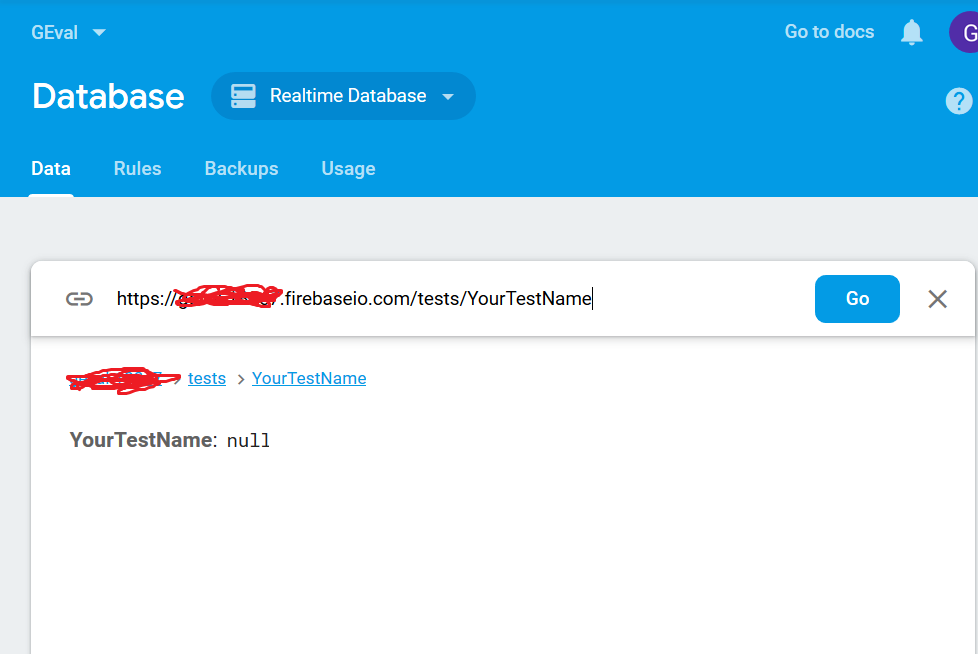
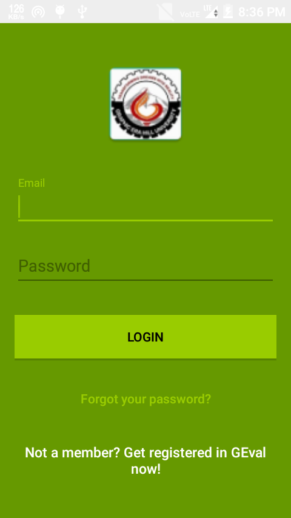
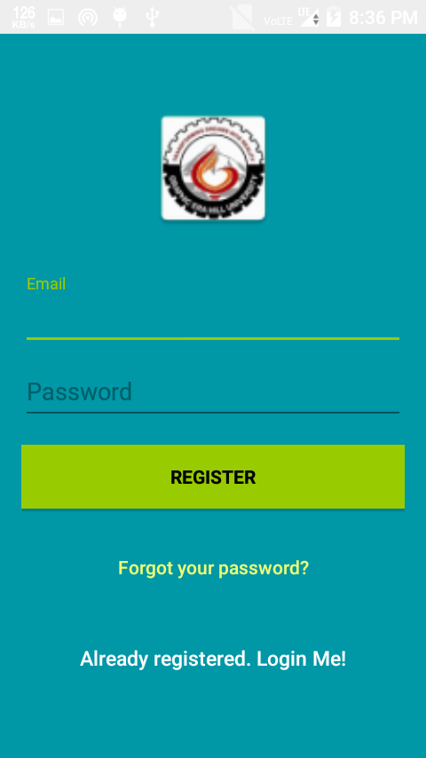
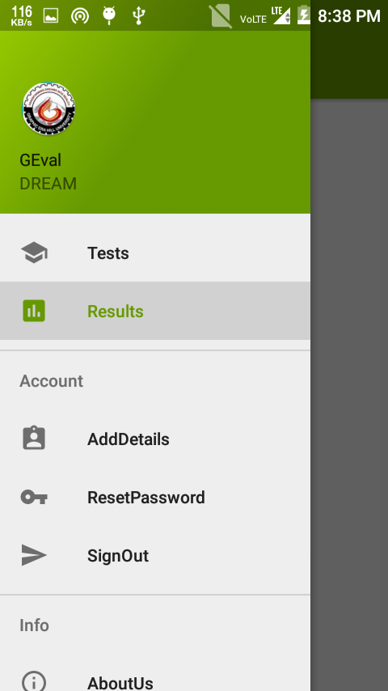
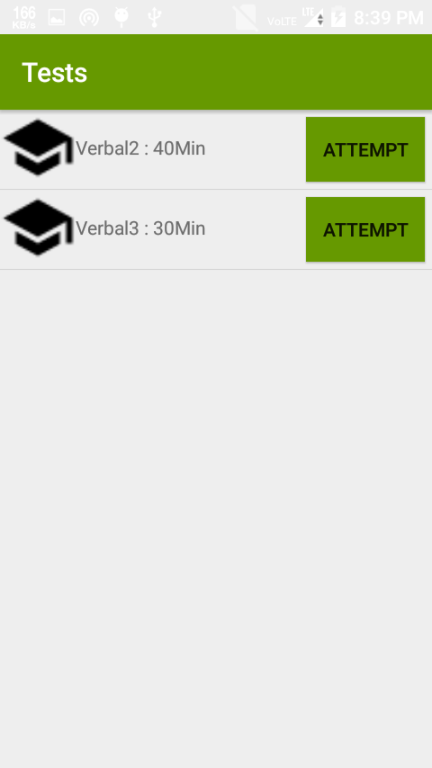
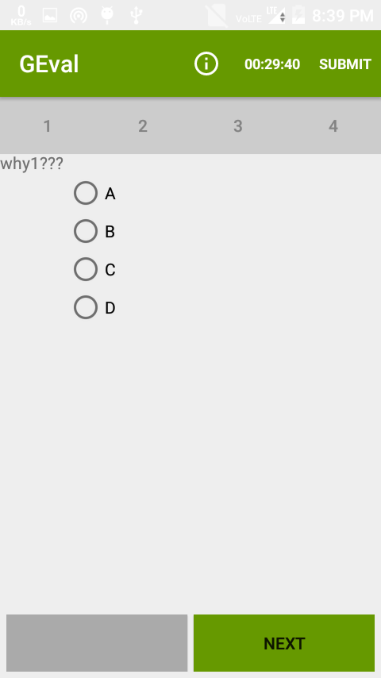
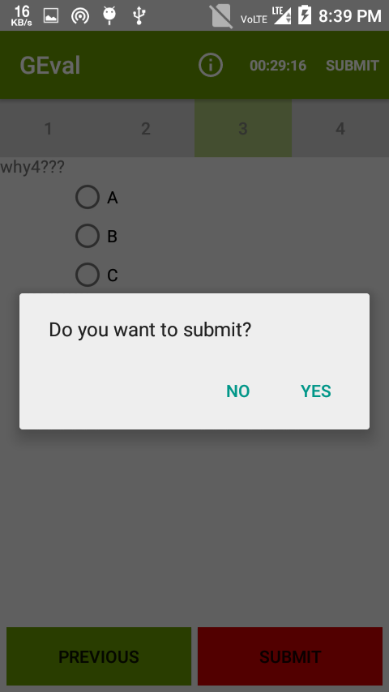
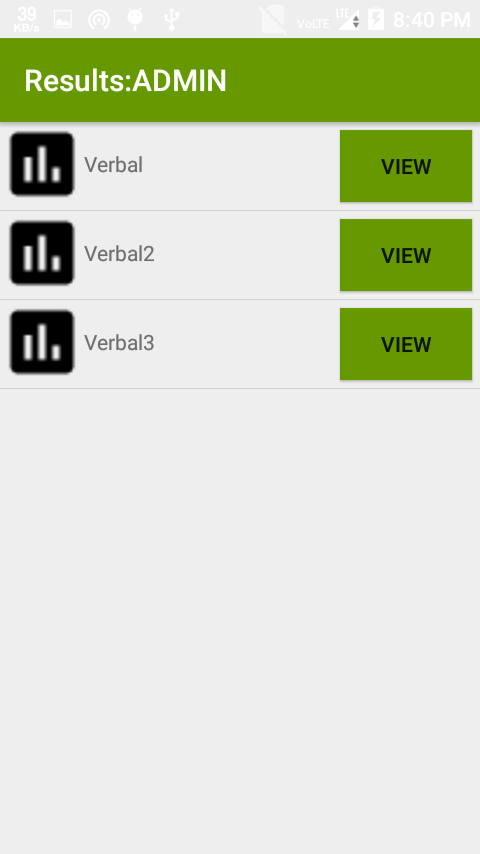

GEval
=====

An app to host your own tests and evaluate students.
GEval uses Google's firebase for hosting the test and authentication. GEval lets you specify the admin accounts in firebase database. Admin account has access to all the results and other features automatically.

## Uses

### Setting up firebase

Create a firebase project [here](https://console.firebase.google.com)

[Refer to firebase docs](https://firebase.google.com/docs/android/setup)

You will get a `google-services.json` file if you have added firebase to android manually. Paste this file in `/GEval/`.

### Enabling Authentication

[Refer to firebase docs](https://firebase.google.com/docs/auth/)

### Creating database 

The Firebase Realtime Database is a cloud-hosted database. Data is stored as JSON and synchronized in realtime to every connected client.

GEval app has particular format of database. If you wish to change the database as per your requirement please change the app code accordingly.

We need not worry about `Results` and `users` child in root of database as they are created automatically.

The 'admins' and 'tests' child in root are to be added manually in this format.

     

#### Creating Tests

To upload tests in realtime database go to the specified link inside firebase's database.

     

Add your questions, options and Time in this database child.You can easily do so using `Import JSON` feature of firebase. Using any online editor edit this [JSON question template](https://raw.githubusercontent.com/Gauravv97/GEval/master/QuesTemplate.json) and import it to your test.

#### Adding Admins

Create a child `admins` in root and add child with name= "user-id" which can be seen from authentication tab in firebase console and Value=true.

## Screenshots

#### User Interface

           

#### Test Window

        
     

## Attributions/Thanks/External code

[Firebase](https://firebase.com)

## About

Copyright 2018 Gaurav Chaudhari, and licensed under the Apache License, Version 2.0. No attribution is necessary but it's very much appreciated. Star this project if you like it!

